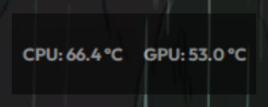
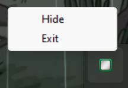

# SimpleHWMonitor
**SimpleHWMonitor** is a lightweight wrapper for **OpenHardwareMonitor**. It displays **CPU** and **GPU** temperatures in a semi-transparent (50% opacity) overlay at the top-right corner of your screen. The **Hide** and **Exit** options are accessible via the system tray icon.

## Features Overview
#### Overlay: Shows CPU/GPU temps at 50% opacity in the top-right corner.


#### System Tray: A tray icon provides quick access to hide or exit the application.



## Build / Compilation
This project was compiled using PyInstaller with the following command:

```bash
pyinstaller --noconsole --onefile --name "SimpleHWMonitor"\
    --icon "icon.ico" \
    --add-data "OpenHardwareMonitor/*;OpenHardwareMonitor" \
    --add-data "icon.ico;." \
    --add-data "Outfit-Bold.ttf;." \
    --hidden-import psutil main.py
```
> Note: The standalone .exe is placed in the root directory. 

## Source Code
The source code can be found in `source/`.

If you try to run the `main.py` file as-is, it will not work without a modification. In particular, the helper function `resource_path()` must be adapted to correctly locate dependencies. For example:

```python
def resource_path(relative_path):
    try:
        # PyInstaller creates a temporary folder and stores its path in _MEIPASS
        base_path = sys._MEIPASS

    except AttributeError:
        # If not running as a PyInstaller executable, use the source directory
        base_path = os.path.abspath(".")
    return os.path.join(base_path, relative_path)
```

When bundled by PyInstaller, `sys._MEIPASS` points to a temporary folder where packaged resources are unpacked. If you want to run the code in normal Python (outside of a PyInstaller build), you must adjust how `resource_path` is resolved so it can find the `OpenHardwareMonitor` folder and other assets.

## License Information
- **SimpleHWMonitor** is licensed under the **Mozilla Public License 2.0 (MPL 2.0)**. This means that you are free to use, modify, and distribute this software under the same license terms.
- **OpenHardwareMonitor** is also licensed under the **GPLv3**. While  the source code for OpenHardwareMonitor is not included in this repository, it is packaged within the `.exe`.
- You can obtain a copy of the **GPLv3** license text directly from
    - [Mozilla Official Website](https://www.mozilla.org/en-US/MPL/2.0/)
    - [OpenHardwareMonitor Repository](https://github.com/openhardwaremonitor/openhardwaremonitor)

## License
This project is licensed under the [Mozilla Public License 2.0 (MPL 2.0)](https://www.mozilla.org/en-US/MPL/2.0/).

> Disclaimer: This README does not constitute legal advice. If you have any specific questions regarding licenses or distribution of open-source software, please consult a qualified attorney.
